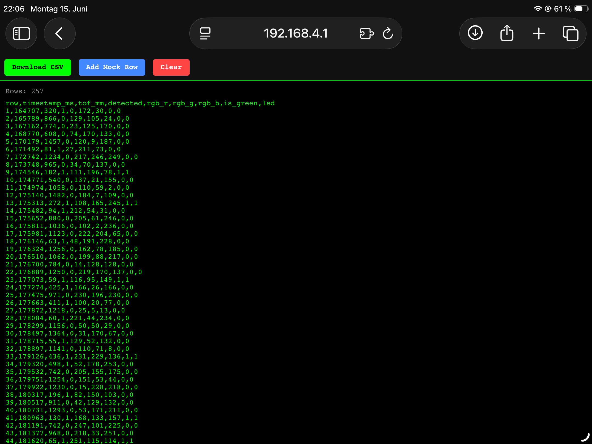

# ESP32-S3 Plant Detection Sensor

Detects plants using dual ToF (distance) + RGB (color) sensors and lights up an indicator LED when a green object is found. Sensor data is streamed live to a browser via WiFi WebSocket.

---

## Features

- **2× VL53L0X** — Time-of-Flight distance sensors (detect object within 500 mm)
- **2× TCS34725** — RGB color sensors (confirm object is green)
- **WiFi Access Point** — connect phone/laptop directly, no router needed
- **WebSocket terminal** — live sensor log in browser at `http://192.168.4.1`
- **2× LEDs** — light up when the paired sensor detects a green plant

---

## Hardware

### Wiring

| Component | Pin | ESP32-S3 GPIO |
|-----------|-----|---------------|
| **ToF1 + ToF2** | SDA | 8 |
| | SCL | 9 |
| ToF1 | XSHUT | 5 |
| ToF2 | XSHUT | 6 |
| **RGB1** | SDA | 35 |
| | SCL | 36 |
| **RGB2** | SDA | 12 |
| | SCL | 13 |
| LED 1 | | 40 |
| LED 2 | | 41 |

### I2C Layout

```
Wire  (I2C0, GPIO 8/9)  : ToF1 (0x30) + ToF2 (0x31)
Wire1 (I2C1, GPIO 35/36): RGB1 (0x29)  ┐ pin switching
Wire1 (I2C1, GPIO 12/13): RGB2 (0x29)  ┘ before each read
```

> ToF sensors share I2C0. XSHUT pins are used during boot to assign them different addresses (0x30 / 0x31).  
> Both RGB sensors have a fixed address (0x29) so they each get a dedicated pair of SDA/SCL pins on I2C1, switched at runtime.

---

## Logic

```
ToF1 detects object  AND  RGB1 confirms green  →  LED1 ON
ToF2 detects object  AND  RGB2 confirms green  →  LED2 ON
```

Sensor readings are sent to the browser terminal every ~300 ms.

---

## WiFi Terminal

1. Power on the ESP32-S3
2. Connect to WiFi: **`ESP32-Sensor`** / **`12345678`**
3. Open browser → **`http://192.168.4.1`**



---

## Libraries Required

Install via **Arduino Library Manager**:

| Library | Author |
|---------|--------|
| `VL53L0X` | Pololu |
| `Adafruit TCS34725` | Adafruit |
| `Adafruit BusIO` | Adafruit |
| `WebSockets` | Markus Sattler |

---

## Build & Flash

1. Open `Arduino_VL53L0X_TCS34725.ino` in Arduino IDE
2. Select board: **ESP32S3 Dev Module**
3. Upload speed: **115200**
4. Flash and open Serial Monitor to see the AP IP address

---

## File Structure

```
Arduino_VL53L0X_TCS34725/
├── Arduino_VL53L0X_TCS34725.ino   # Main sketch
└── README.md
```
